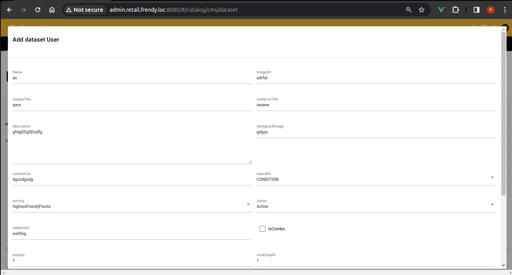

# QNATK - Nest

## Overview
 QNATK - N(Nest) is a RAD framework extension for quasar and nest + sequelize.
 The main purpose of QNATK is to reduce the repeatative requirements like error handling , input validation and model mapping when developing web applications.

 The another main purpose is code maintainability  and reusability, so we can reuse components in different projects with minimal changes.
## Nest Js Setup
For installation nest js and require basic setup you should go to following link:

[Nest JS](https://docs.nestjs.com/)


## Installation
!!! warning
    Currently it is a Beta version thats why you have to use it through submodule, later we will convert it into a node package so you can install it with the help of npm. 
<br>
 Access the QNATK from following git command:

```bash
git submodule init
git submodule add https://github.com/gowrav-vishwakarma/qnatk-n src/qnatk
```
## Updation
 Later you will have to update the submodule  using the following command:

    git submodule update --remote

##  Features
Backend is the combination of 2 features:

1. Hook System.<br>
1. [Graph QL](https://docs.nestjs.com/graphql/quick-start) style sequelize system.<br>
<!-- 

*Above: Cupcake indexer in progress*  -->