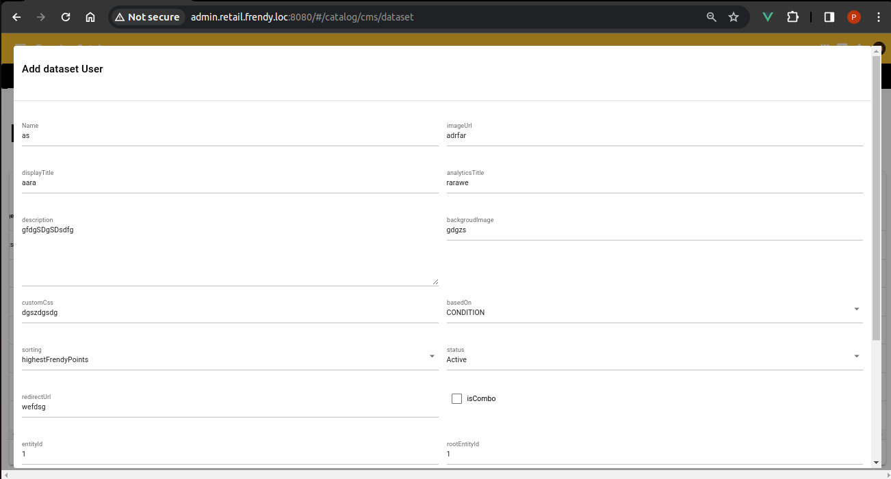

# QNATK - Quasar

## Overview
 QNATK - Q(Quasar) is a RAD framework extension for quasar and nest + sequelize.
 The main purpose of QNATK is to reduce the repeatative requirements like error handling , input validation and model mapping when developing web applications.

 The another main purpose is code maintainability  and reusability, so we can reuse components in different projects with minimal changes.
## Installation

!!! warning
    Currently it is a Beta version thats why you have to use it through submodule, later we will convert it into a node package so you can install it with the help of npm. 

 
 Access the QNATK from following git command:

    git submodule init
    git submodule add https://github.com/gowrav-vishwakarma/qnatk-q src/qnatk

## Updation
 Later you will have to update the submodule  using the following command:

    git submodule update --remote
<!-- 

*Above: Cupcake indexer in progress*  -->

##  Features
Frontend is the combination of 3 features:

1. Few extensible [Vue Components](https://vuejs.org/guide/essentials/component-basics.html). 
1. Few [Vue composibles](https://vuejs.org/guide/reusability/composables.html). 
    
    - Composibles consists  of: 

        - `use-forms`
        - `use-datatables`

1. Few interfaces and types for easy work. 
<!-- 1. **QDataTable** : It provides CRUD operations on data models with pagination, -->

